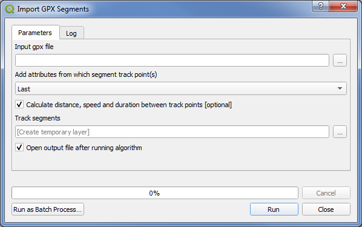

# GPX Segment Importer
QGIS Plugin

This repository contains the source code for the plugin.

## Overview

The native GPS eXchange Format (GPX) file importer for the open-source geo-information software QGIS features multiple options to create vector layers. This includes the import of track points as a point dataset and the import of the whole track as a single linestring. If the GPX data contains attributes associated to the track points, only the track point option can be used to read and visualize those attributes. Visualizing them as line segments has not been possible so far. To overcome this missing feature, I have implemented the QGIS plugin “GPX Segment Importer” to visualize attributes as line segments between the track points.

## Features

* Select one or multiple GPX files with the same data structure at once and create short line segments between the track points.
* Read all attributes available from each track point at the segment start and/or end. This includes the timestamp and the elevation as well as any other attributes added to a track point.
* To gain full control over the data, you can edit the attribute table before creating the segment layer. The user can select the attributes that should be included in the layer, modify the attribute label and change the data type (integer, double, boolean or string) if the automatic type detection failed, e.g. at numeric data that contains “Null” or “None” values.
* The plugin detects attributes that do not have a value and deselects it. Values can still be selected manually.
* Optionally calculate motion attributes (distance, speed, duration and elevation_diff) between track points.
* Create a temporary memory layer or write the layer to a GeoPackage.
* [Update v2.1] GPX segment Importer also available as QGIS algorithm for usage in processing.
* [Update v2.2] Add new algorithm 'Track segment creator': Use any point vector dataset that has a timestamp attribute to create line segments.

## Use of plugin

The plugin is available in the QGIS plugin repository. Just open the plugin repository through the QGIS menu „Plugins” > „Manage and Install Plugins” and search for „GPX Segment Importer“. Select it and press „Install plugin”.

The algorithm "Import GPX segments" is available in the toolbox.
The tool can be accessed via the “Manage Layers Toolbar” or via the menu „Plugins” > „GPX Segment Importer”.

## Notes
* By default, the attributes of the latter track point are used for the line segment
* Consecutive track points with equal coordinates are skipped in order to avoid creating single vertex linestrings
